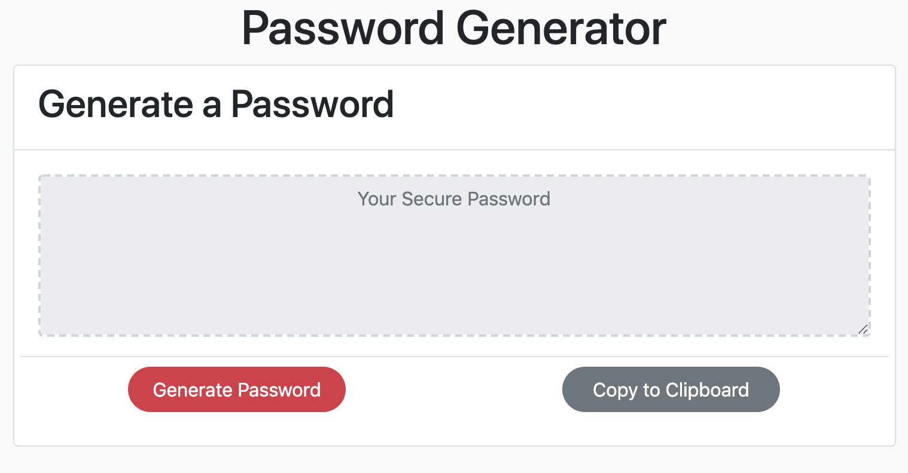

# Unit 03 JavaScript Homework: Password Generator

## Description

This application generates a random password based on user-selected criteria. It runs in the browser and features dynamically updated HTML and CSS powered by JavaScript code.

After clicking Generate Password, the user is prompted to choose from the following password criteria:

* Length (must be between 8 and 128 characters)

* Character type:

  * Special characters ([see examples](https://www.owasp.org/index.php/Password_special_characters))

  * Numeric characters

  * Lowercase characters

  * Uppercase characters

The application validates user input and ensures that at least one character type is selected.

Once all prompts are answered, the user is presented with a password matching the answered prompts. The password is displayed on the page.

The user has the option to click a button to copy the password to the clipboard.

The application has a clean user interface and is responsive, meaning it adapts to multiple screen sizes.
